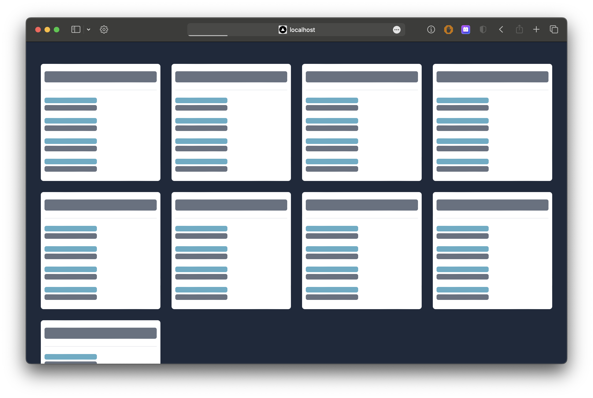

# QU - Web Developer Challenge

## Tech Stack
- [Typescript](https://www.typescriptlang.org)
- [Turborepo](https://turbo.build/repo)
- [Nuxt](https://nuxt.com)
- [ReactNative](https://reactnative.dev)
- [TanStack Query](https://tanstack.com/query/)
- [Tailwind](https://tailwindcss.com)
- [Tailwind-rn](https://github.com/vadimdemedes/tailwind-rn)


## Notes for the Code Reviewer.
<blockquote>
I had some experience working with VueJs v2 (~1 year).
After that I stopped using it. The reason was that the company I worked choosed React as the framework for all the new projects.  
  
Anyway, I liked it and because it is recommended for use on this challenge, I'll use it along with NuxtJs.
I'm going to be learning Vue3 composition API and Nuxt while developing this (I never used them before). I'll be following the official documentations and using my own criteria, to create and organize the source code in the best way I can using this tech-stack.  

Furthermore, I think that working with a monorepo could make this exercise more funny. I'm planning to add an alternative client (a ReactNative app). My objective is provide you with more data about my style and abilities related to coding (particularly an example of a React application). 
I'll be using Tailwind. I think this library can help styling the UI and keeping some consistency between clients.
</blockquote>

### Recommendations to developers
This project was developed using Microsost VS Code.
The following extensions are highly recommended to be installed and activated in the project workspace:
- [TypeScript Vue Plugin (Volar)](https://marketplace.visualstudio.com/items?itemName=vue.vscode-typescript-vue-plugin)
- [Tailwind CSS IntelliSense](https://marketplace.visualstudio.com/items?itemName=bradlc.vscode-tailwindcss)


### Before start
Complete the `.env` files inside the Apps folders. For the sake of simplicity the content of `.env.example` can be copied and pasted.

### Scripts
`npm install`: Install dependencies.

`npm run dev`: Run the Web App: 

### Roadmap
- [X] Setup the Monorepo (Turborepo)
- [X] Setup the WebApp dependencies (Nuxt/Tailwind)
- [X] WebApp: Develop Planet's list screen (with sorting functionality)
- [ ] ~WebApp: Add planet details screen~
- [ ] ~Setup RN Application.~
- [ ] ~MobileApp: Develop Planet's list screen (with sorting functionality)~
- [X] Complete Readme docs (Answer challenge's questionary).
- [ ] Add design to the Error Page (uncaught exceptions) (Nice to Have)
- [ ] i18n (Nice to Have)


### RN Application
~In order to run the RN Application you will need XCode installed (tested on v15.2) and a correct enviroment setup. More information [here](https://reactnative.dev/docs/environment-setup?package-manager=npm&guide=native#installing-dependencies)~

Update:
I wasn't able to run the Mobile application properly.
At first RN give problems due to the path of the \*react_native\* modules. I solved that problem switching to Yarn and using the [nohoist feature](https://classic.yarnpkg.com/blog/2018/02/15/nohoist/).

After that, XCode exited with a non-zero code. I think that could be related to NVM (node version manager), but it could be something else. I have no time to continue debugging, sorry I would like to create a mobile version using the same styling and reusing the _@packages/Swapi_ utilities.

I worked on a RN challenge some time ago. It is public on my repository, they ask me to make it that way, so I think, if you like, you can review an example of a RN app made by me there. It's quite simple too, just a few files, but I setup ReactQuery and Navigation there.
[Github Repository](https://github.com/javierdwd/RNBlazeChallenge)


### Questionary
#### What's a closure? Where in the code is there a closure?

I'll take the definition from the [w3cschool.com](https://www.w3schools.com/js/js_function_closures.asp)
<blockquote>
  A closure is a function having access to the parent scope, even after the parent function has closed.
</blockquote>

An good example of a closure feature usage in the code is the `sortPlanetsBy()` function.

```ts
// Currying: [].toSort(sortPlanetBy('title')) 
export const sortPlanetsBy = (sortBy: keyof Planet) => 
  (itemA: Planet, itemB: Planet) => {
    if(sortBy === 'name') {
      return itemA.name.localeCompare(itemB.name)
    }

    const itemANum = Number(itemA[sortBy]);
    const itemBNum = Number(itemB[sortBy]);


    if(!isNaN(itemANum) && isNaN(itemBNum) || itemANum < itemBNum){
      return -1; 
    } else if(isNaN(itemANum) && !isNaN(itemBNum) || itemANum > itemBNum) {
      return 1
    }
    return 0;
  }
```

This function return another one, which "remembers" the logical scope where it was created. This way I can access the `sortBy` value even outside of the function body.


---

#### Which are the potential side-effects in any function? Could you point out any of these cases in your code? Are they expected? Can they be avoided?

Side-effects in a function are changes that the code inside a function could produce in the system during its execution.

For instance `Array.prototype.sort` modifies the the original array, causing a side-effect. If you  want to avoid this behavior you can use `Array.prototype.toSorted` which creates and return a new array.

I made use of this along with `sortPlanetsBy` (inside the _PlanetList.vue_ file) because I wanna keep the inmmutability of the original variable.


### Screenshots



